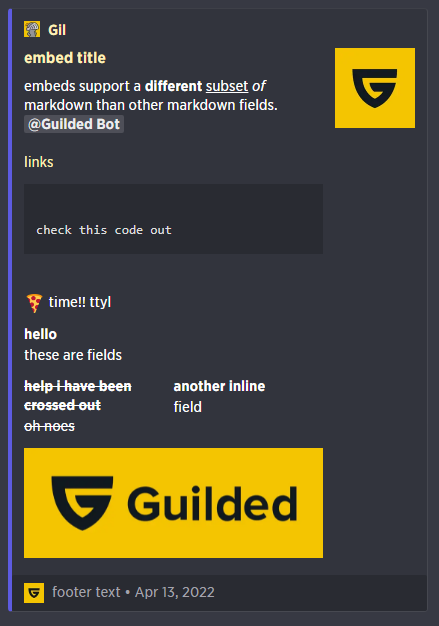

# Guilded self-bot console

A simple Guilded Self-bot using console. Intended for quick scripts runnable directly from the devtools.

# You can join Community server

[https://www.guilded.gg/i/k3nl11N2](https://www.guilded.gg/i/k3nl11N2)

# Disclaimer

Automating user accounts is against [Guilded Terms of Use](https://support.guilded.gg/hc/en-us/articles/360039728313-Terms-of-Use). You might get banned if you abuse it (too much spam, unusual activity).

# Usage

1. Open Chrome devtools on Guilded using `Ctrl + shift + i`
2. Go to the console tab and paste the entire [`index.js`](./index.js) script
3. Add your token to 3th line (More info on [FAQ](https://github.com/DeadLyBro/guilded-self-bot-console#how-can-i-get-authheader-api-key))
4. ...
5. Profit!

You can now use any function provided by this script in the console like `await api.someFunction()`. Don't forget `await` or the server's response will not be printed to the console.

Use the `id()` function to update the variable `sid` server id, `gid` group id and `cid` channel id to what you are currently watching.

**Note:** It's a good idea to wrap your code in its own scope `{ code }` or you might get an error when reusing the same variable names later!

# Examples

## Basic example

Update `cid` to the channel you are watching, get the last 100 messages, send a message, edit then delete.

```js
{
  id()
  let channelId = cid

  // Send a message
  let sentMessage = await api.sendMessage(channelId, 'Hello!')

  await delay(2000)

  // Edit a message
  let editedMessage = await api.editMessage(channelId, sentMessage.message.id, 'Hello, edited!')

  await delay(2000)

  // Delete a message
  await api.deleteMessage(channelId, editedMessage.id)

  await delay(2000)

  // Log the last 100 messages
  let messages = await api.getMessages(channelId)
  console.log(messages)
}
```

## Automatic reply chat with some response

You can change `const search` and `let messages`

```js
{
    id();

    const channelId = cid;
    const serverId = sid;

    const search = [`Gm`,`GM`,`Morning`,`GM bro`,`yo`,`sup`,`wsup`]
    let message = [`GM Fam`,`Gm, how are u?`,`morning bro`,`yo, how are u?`,`all good fam`,`good bro, hbu?`]
	
    const seenMessagesIds = new Set();
	
    var loop = true;
    var i = 0;
	
    let welcome = await api.sendMessage(channelId, 'Welcome...'); // If you delete this message, code don't work
    let userId = welcome.message.createdBy // If you delete welcome message, code don't work
	
    while (loop) {
        const messages = await api.getMessages(cid, 100, { after: welcome.message.createdAt });

        const found = messages.messages.filter(msg => msg.content.includes(search[i]) && !seenMessagesIds.has(msg.id) && msg.createdBy != userId );
        
        if (found.length > 0) {
		for (const msg of found) {
                	console.log(`Found message | ID= ${msg.id} | C= "${msg.content}" | A= ${(await api.getUser(serverId, msg.createdBy)).member.user.name}#${(await api.getUser(serverId, msg.createdBy)).member.user.id}`);
                	seenMessagesIds.add(msg.id);
                	await api.replyToMessage(msg.channelId, msg.id, message[i]);
            	}

        }

	i = (i + 1) % search.length

        await api.delay(5*1000);
    }
}
```

## Send an embed

```js
{
id()
let channelId = cid

const embed = {
  "title": "embed title",
  "description": "embeds support a **different** __subset__ *of* markdown than other markdown fields. <@Ann6LewA>\n\n [links](https://www.guilded.gg) ```\ncheck this code out```\n\n:pizza: time!! ttyl",
  "url": "https://www.guilded.gg",
  "color": Math.floor(Math.random() * 16777215) + 1, // Randomize color
  "timestamp": "2022-04-12T22:14:36.737Z",
  "footer": {
    "icon_url": "https://www.guilded.gg/asset/Logos/logomark/Color/Guilded_Logomark_Color.png",
    "text": "footer text"
  },
  "thumbnail": {
    "url": "https://www.guilded.gg/asset/Logos/logomark/Color/Guilded_Logomark_Color.png"
  },
  "image": {
    "url": "https://www.guilded.gg/asset/Logos/logomark_wordmark/Color/Guilded_Logomark_Wordmark_Color.png"
  },
  "author": {
    "name": "Gil",
    "url": "https://www.guilded.gg",
    "icon_url": "https://www.guilded.gg/asset/Default/Gil-md.png"
  },
  "fields": [
    {
      "name": "hello",
      "value": "these are fields"
    },
    {
      "name": "~~help i have been crossed out~~",
      "value": "~~oh noes~~",
      "inline": true
    },
    {
      "name": "another inline",
      "value": "field",
      "inline": true
    }
  ]
}

await api.sendEmbed(channelId, embed)
}
```



## Use a bot account

This specific script only works for user accounts. If you want to use a bot account, you need to use guilded.js!

## Farm XP

Send a `message` to a channel (`channelId`) every minute then delete it (useful for XP farming in some servers).

You can use `loop = false` at any time to stop it.

```js
{
  id()
  let channelId = cid
  let message = 'Hi, I like spamming 🦜'

  var loop = true
  let count = 0
  while (loop) {
    const sentMessage = await api.sendMessage(channelId, message)
    await api.deleteMessage(channelId, sentMessage.message.id)
    console.log(`Sent ${++count} messages`)
    await delay(61000) // 61 seconds
  }
}
```

## Clear messages of user

Delete the `amount` messages from user (`userId`) sent to a channel/DM (`channelId`) appearing before message and wait `delayMs` milliseconds everytime.

You can use `loop = false` at any time to stop it.

Guilded recently made its rate limiting strictier. I recommend 1100ms or 1500ms as a minimum to not get rate limited. Make it even bigger if you are affraid of getting banned.

```js
{
    id();
    const userId = ""; // Specified User's id
    const channelId = cid;
    const serverId = sid;
    var loop = true;

    let delayMs = 5 * 1000
    let deletionCount = 0

    var amount = 5; // Deletion amount

    while (loop) {
        const messages = await api.getMessages(cid, 100, { before: new Date(Date.now()).toJSON() });
		
		if (messages.messages.length < 100 && messages.messages.filter(x => x.createdBy === userId).length === 0) {
			loop = false
			console.log(` [${deletionCount}/${amount}] Reached the start of the conversation!`)
			continue
		}

        for (const aMessage of messages.messages) {
            if (loop === false) break

            if (deletionCount >= amount) {
                loop = false
                console.log(` [${deletionCount}/${amount}] Deleted the requested amount of messages! `)
                break
            }

            if (aMessage.createdBy === userId) {
                await api.deleteMessage(channelId, aMessage.id)
                deletionCount++
                console.log(` [${deletionCount}/${amount}] Deleted a Message! `)
                if (deletionCount < amount) await delay(delayMs)
            }

        }

        await delay(delayMs)
    }
}
```

## Send message with user mention

```js
{
    id();
    api.sendMessage(cid, ``, {
  "content": {
    "object": "value",
    "document": {
      "object": "document",
      "data": {},
      "nodes": [
        {
          "object": "block",
          "type": "paragraph",
          "data": {},
          "nodes": [
              {
              "object": "inline",
              "type": "mention",
              "data": {
                "mention": {
                  "type": "person",
                  "matcher": "@username",
                  "name": "user-name", // E.g: Gil
                  "id": "user-id", // E.g: AbC213
                }
              }
            },
            {
              "object": "text",
              "leaves": [
                {
                  "object": "leaf",
                  "text": " ",
                  "marks": []
                }
              ]
            },
            {
              "object": "text",
              "leaves": [
                {
                  "object": "leaf",
                  "text": "Your message",
                  "marks": []
                }
              ]
            }

          ]
        }
      ]
    }
  }
}
                    );
}
```

## Do anything to every messages (already sent) in a text channel

Pass your custom function!

This example will apply all reactions already there on all messages, then add 👋 if message says `hi!!` or `hello`.

```js
{
  id()
  let channelId = cid
  let amount = 99999999
  let delayMs = 500

  const seenMessageIds = new Set()

  let actionFn = async (channelId, message) => {
    //
    // Your custom code here
    //
    let wasActiontriggered = false

    // Copy all reactions already present on message
    for (const reaction of message.reactions || []) {
      let reactionToAdd = reaction.emoji.id ? `${reaction.emoji.name}:${reaction.emoji.id}` : reaction.emoji.name
      await api.addReaction(channelId, message.id, reactionToAdd)
      wasActiontriggered = true
      await delay(delayMs)
    }

    // If person said `hello!!!` or `hi!`, react with waving hand 👋
    if (message.content.match(/^(?:hi|hello)!*$/) && !seenMessageIds.has(message.id)) {
      await api.addReaction(channelId, message.id, 90001206)
      seenMessageIds.add(message.id)
      wasActiontriggered = true
    }

    // Return a boolean indicating if you did something to the message
    // If true, will log and apply delay
    return wasActiontriggered
  }

  let beforeTime = new Date(Date.now()).toJSON() // Leave it like this to react from latest

  let count = 0
  var loop = true
  while (loop) {
    const messages = await api.getMessages(channelId, 100, { before: beforeTime })

    // We reached the start of the conversation
    if (messages.messages.length < 100 && messages.messages.filter(msg => msg.type === "default" && msg.content.match(/^(?:hi|hello)!*$/) && !seenMessageIds.has(msg.id)).length === 0) {
      loop = false
      console.log(`[${count}/${amount}] Reached the start of the conversation! Ending.`)
      continue
    }

    for (const aMessage of messages.messages) {
      if (loop === false) break

      // Check if the max amount was reached
      if (count >= amount) {
        loop = false
        console.log(`[${count}/${amount}] Treated the requested amount of messages! Ending.`)
        break
      }

      // Check if the message should be reacted
      if (aMessage.type === "default") {
        let wasActiontriggered = await actionFn(channelId, aMessage)
        // Apply delay and log only if return true
        if (wasActiontriggered) {
          count++
          console.log(`[${count}/${amount}] Treated a message! ID=${aMessage.id}`)
          if (count < amount) await delay(delayMs)
        }
      }
    }
    await delay(delayMs)
  }
}
```

## Edit Your Nick Multiple Time with Delay

```js
{
    id()
    const nick = ['Nick1', 'Nick2', 'Nick3'] // You can change nicks here. e.g: const nick = ['Foo','Bar']
    const serverId = sid
    const channelId = cid
    var loop = true
    let nickIndex = 0
    let count = 0
    
    const userId = await api.sendMessage(channelId, "Hm...")
    setTimeout(async function() {
        await api.deleteMessage(channelId, userId.message.id)
    }, 1100)
    
    while (loop) {
        await api.editNick(serverId, userId.message.createdBy, nick[nickIndex])
	console.log(`Nick changed ${++count} times.`)
        nickIndex = (nickIndex + 1) % nick.length
        await api.delay(10 * 1000)  // Wait 10 second, 1000 is equal to one second
    }
}
```

If you want to specify `userId` try this; 

```js
{
    id()
    const nick = ['Nick1', 'Nick2', 'Nick3']
    const serverId = sid
    const channelId = cid
    var loop = true
    let nickIndex = 0
    let count = 0
    
    const userId = "userId" // Edit here, e.g: const userId = "aBc123"
    
    while (loop) {
        await api.editNick(serverId, userId, nick[nickIndex])
	console.log(`Nick changed ${++count} times.`)
        nickIndex = (nickIndex + 1) % nick.length
        await api.delay(10 * 1000)  // Wait 10 second, 1000 is equal to one second
    }
}
```


# FAQ

## How can i get authHeader? (Api Key)

If you want authHeader key; just create a server and create a new bot, you can get the bot's token. (You can use that token with guilded.js too!) 
And write index.js's top like this; `authHeader = 'Bearer token'` ( There is an example there. )

## Will I get banned if I do x?

I don't know, maybe u can banned. I have used lots of scripts in the past, not Guilded but Discord, often deleted 100+ messages of mine, accross servers and never got banned, ever.

But I can't guarantee anything. Use at your own risk.

Automating user accounts is againt [Guilded Terms of Use](https://support.guilded.gg/hc/en-us/articles/360039728313-Terms-of-Use).

## Can it do x? Can you help me?

Post your requests in the [Discussions](https://github.com/DeadLyBro/guilded-self-bot-console/discussions) tab. Please search if your request was not mentionned in an earlier post before asking.

## I made a nice/useful script, can I share?

Of course! Post it in the [Discussions](https://github.com/DeadLyBro/guilded-self-bot-console/discussions) tab. Please search if a similar script was shared earlier before posting.

## Why this repo?

I don't think there are many users of Guilded, but I thought I'd do it.

# API

## Full list

Here is the full list of available functions, check [`index.js`](./index.js).

```js
id()
delay(ms)
api.apiCall(apiPath, body, method = 'GET')    // Default apiCall.
api.apiCallv1(apiPath, body, method = 'GET')  // apiCall with no Body. If you get 'Request with GET/HEAD method cannot have body.' & using api ver, use this.
api.apiCal(apiPath, body, method = 'GET')     // apiCall with no Version, this is don't using version.
api.apiCalv1(apiPath, body, method = 'GET')   // apiCal with no Body. If you get 'Request with GET/HEAD method cannot have body.', use this.


// Channels

api.createChannel(name, type, serverId, groupId, categoryId) // type should be; announcements, chat, calendar, forums, media, docs, voice, list, scheduling, or stream.
api.getChannel(channelId)
api.updateChannel(channelId, name, topic, isPublic, body = {})
api.deleteChannel(channelId)

// Servers

api.getServer(serverId)
api.leaveServer(serverId, yourUserId) // This id should be yours.
api.listServers()

// Chat & Messaging

api.sendMessage(channelId, message, body = {})
api.getMessages(channelId, limit, params = {})
api.getMessage(channelId, messageId)
api.editMessage(channelId, messageId, newMessage, body = {})
api.deleteMessage(channelId, messageId)
api.replyToMessage(channelId, repliedMessageId, message, body = {})

// Check this site to avoid posting wrong embed; https://www.guilded.gg/docs/api/chat/ChatEmbed
api.sendEmbed(channelId, embed = { "title": "My Cool Embed", "description": "Some description ;)", "color": Math.floor(Math.random() * 16777215) + 1 }) // if you don't want to set author name/url/icon_url just write undefined. e.g: "author": { "name": undefined, "url": undefined, "icon_url": undefined }

api.pinnedMessages(channelId)
    
api.getDMs(yourUserId)


// Members

api.editNick(serverId, userId, nick)
api.deleteNick(serverId, userId)
api.getUser(serverId, userId)
api.kickUser(serverId, userId)
api.getUsers(serverId)

api.setCustomStatus(text, customReactionId, expireInMs)
api.deleteCustomStatus()

api.setGameStatus(id, gameId, type) // Half-Life; id: '3351', gameId: null, type: 'gamepresence'
api.deleteGameStatus()

api.editBio(userId, bio, tagLine, body = {}) // Just English Characters

// Member Bans

api.banUser(serverId, userId, reason) // I haven't tried
api.getBan(serverId, userId)
api.unbanUser(serverId, userId) // I haven't tried
api.getBans(serverId)

// Forums

api.createTopic(forumId, title, message) // You must look a Forum channel or set forum's id.
api.getTopics(forumId)
api.getTopic(forumId, topicId)
api.updateTopic(forumId, topicId, title, message) // If you see differently enter the topic. 
api.deleteTopic(forumId, topicId)
api.pinTopic(forumId, topicId)
api.unPinTopic(forumId, topicId)
api.lockTopic(forumId, topicId)
api.unLockTopic(forumId, topicId)

// List items

api.createList(channelId, title, content)
api.getLists(channelId)
api.getList(channelId, listId)
api.updateList(channelId, listId, title, content)
api.deleteList(channelId, listId)
api.completeList(channelId, listId)
api.unCompleteList(channelId, listId)

// Docs

api.createDoc(channelId, title, content)
api.getDocs(channelId, params = {})
api.getDoc(channelId, docId)
api.updateDoc(channelId, docId, title, content)
api.deleteDoc(channelId, docId)

// Calendar Events (Calendar buggy refresh Guilded App/Tab to see effects)

api.createCalendar(channelId, name, description, location, startsAt, url, rsvpLimit, duration, isOpen)
api.getCalendars(channelId, params = {})
api.getCalendar(channelId, calendarId)
api.updateCalendar(channelId, calendarId, name, description, location, happensAt, happensAtClientTimezone, url, rsvpLimit, durationInMinutes, isOpen) // You can get error just refresh Guilded App/Tab
api.deleteCalendar(channelId, calendarId)
api.getCalendarRSVP(channelId, calendarId, userId)
api.createOrUpdateRSVP(channelId, calendarId, userId, status) // Status can be; "going", "maybe", "declined", "invited", "waitlisted", or "not responded".
api.deleteRSVP(channelId, calendarId, userId)
api.getRSVP(channelId, calendarId)

// Reactions

api.addReaction(channelId, contentId, emoteId)
api.deleteReaction(channelId, contentId, emoteId)

// Server XP

api.addXP(serverId, userId, xpAmount)
api.setXP(serverId, userId, xpTotal)
api.addRoleXP(serverId, roleId, xpAmount)

// Social Links

api.getSocialLink(serverId, userId, type) 

// Types; 
// "roblox", "epic" for Epic Games, "twitch", "patreon", 
// "steam", "youtube", "switch" for Nintendo Switch, 
// "origin" for Origin (EA), "bnet" for BattleNet (Blizzard Ent.), 
// "psn" for PlayStation Network.

// Group membership

api.addGroup(groupId, userId)
api.removeGroup(groupId, userId)
api.listGroups(serverId)
api.getGroup(serverId, groupId)

// Role membership

api.addRole(serverId, userId, roleId)
api.removeRole(serverId, userId, roleId)
api.getUserRoles(serverId, userId)

// Webhooks

api.createWebhook(serverId, channelId, name)
api.getWebhooks(serverId, channelId)
api.getWebhook(serverId, webhookId)
api.updateWebhook(serverId, channelId, webhookId, name)
api.deleteWebhook(serverId, webhookId)

// Emojis

api.getEmojis(serverId, maxEmoji, searchTerm) // If you don't want to specify emoji name, don't write anything to searchTerm. e.g: `await api.getEmojis(serverId, maxEmoji)`
api.addEmoji(serverId, emojiName, link) // Other links don't work... idk, we should use amazonaws image link? e.g: https://s3-us-west-2.amazonaws.com/www.guilded.gg/CustomReaction/image.webp?w=120&h=120
api.deleteEmoji(serverId, emojiId)


```

## `delay(ms)`

`delay(ms: number) => Promise<void>`

Wait for `ms` milliseconds.

```js
await delay(1500)
```

## `id()`

`id() => void`

Update the variable `sid` server id, `gid` group id and `cid` channel id to what you are currently watching in the Guilded client.

```js
id()
```

## Variables

- `authHeader`: You Guilded account auth token
- `sid`: Current server id (update to what you are currently watching using `id()`)
- `gid`: Current group id (update to what you are currently watching using `id()`)
- `cid`: Current channel id (update to what you are currently watching using `id()`)

# License

[The MIT License](./LICENSE)
